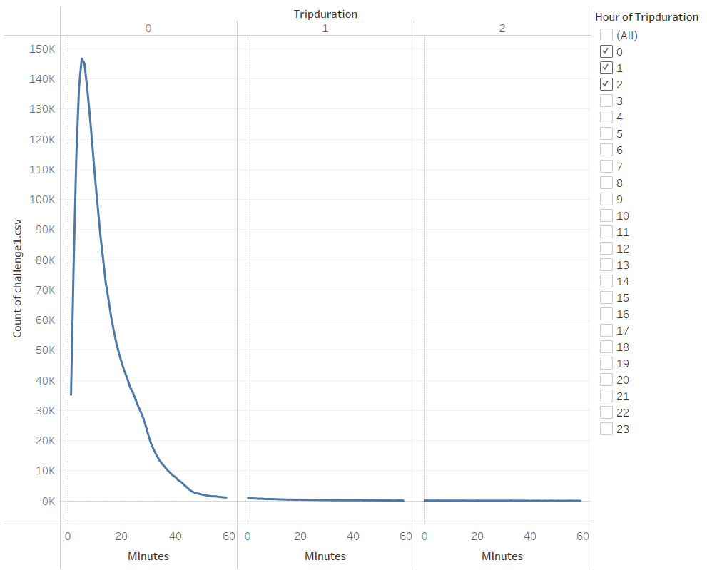
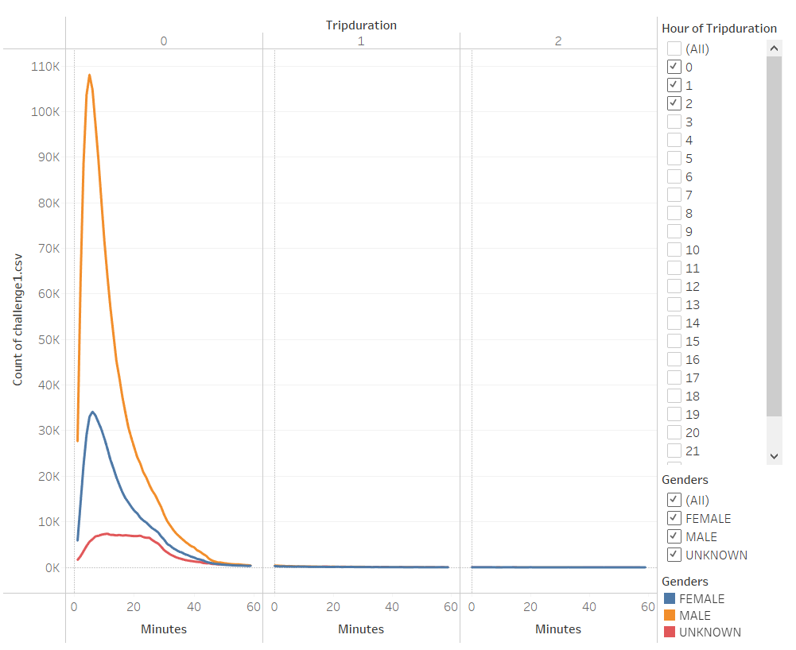
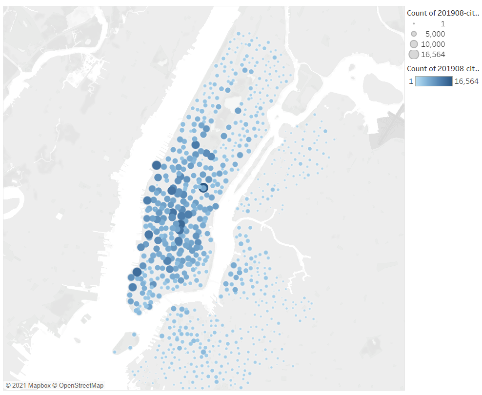
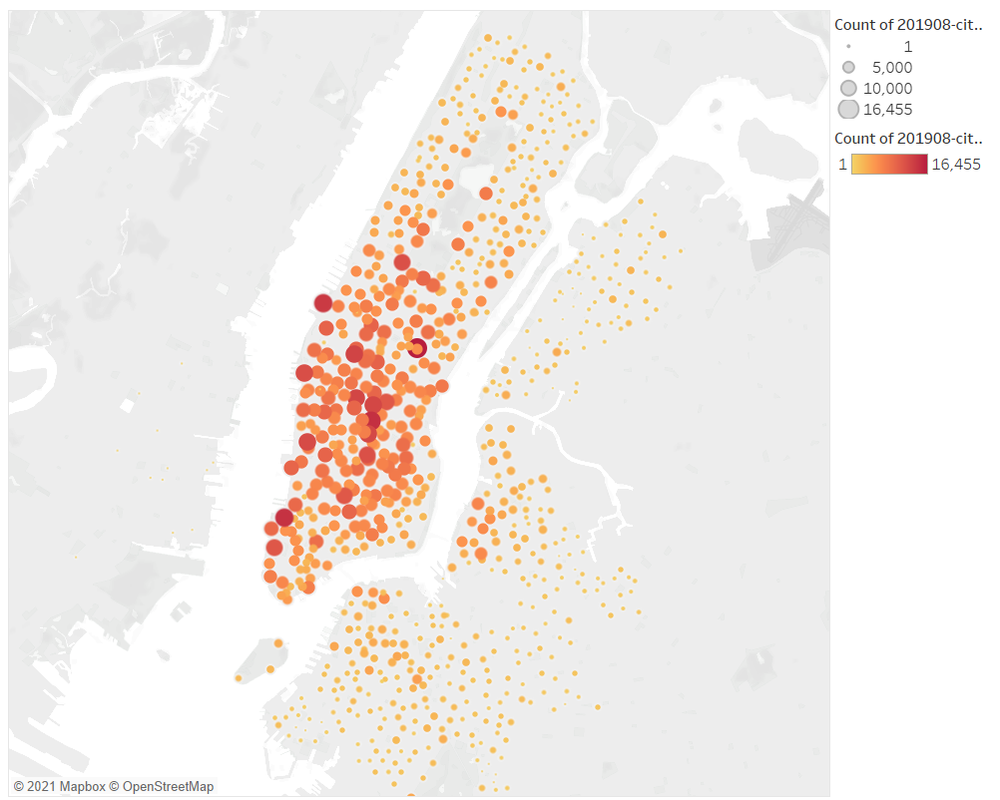
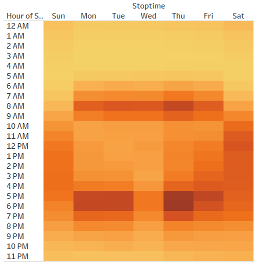
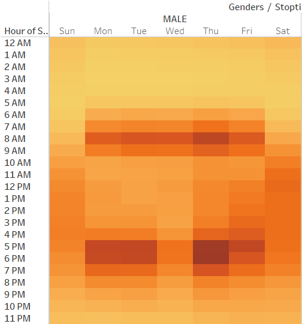
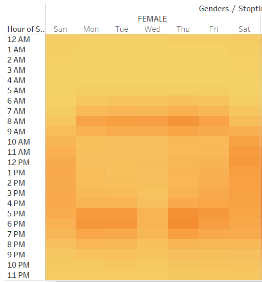
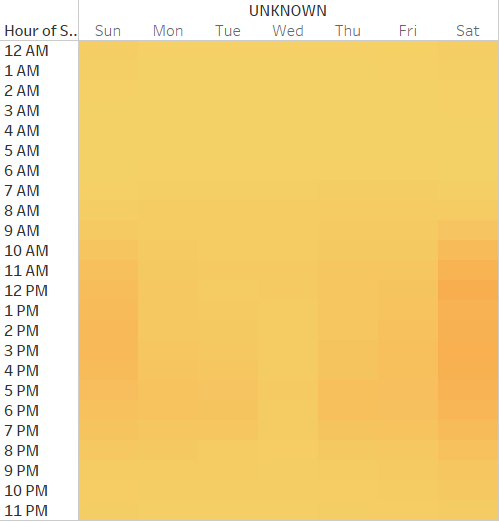
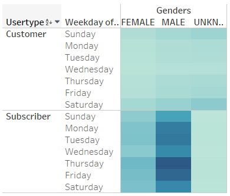

# NYC Citi Bike Share Analysis
## Overview
The purpose of this project is to analyze how the Citi Bike system operating within New York in order to understand how this system functions, and present these findings to our investors in an attempt to secure fundings to create our own bike rental system in Des Moines, Iowa. Our chosen data visualization platform is Tableau Public, which has mapped all of our data for August of 2019.

### Results
There is quite a bit of data to sift through and many angles to look at this endevour through.

Our first area we looked at was rental timing/trip duration. We saw before that this service is wanted, but how much are the people actually using it? Here is a graph displaying trip lengths for the entire userbase:

The line plot plots the number of trips taken for a certian time length. Here, we see that the average bike rental lasts anywhere between a 5-15 minute trip, on average. Breaking down our userbase, we can defer to this next graph:

We see that a majority of users are males, and an almost encompassing portion of Citi Bike users are not going far on these bikes within the average 5-15 minute trip times. This raises a question. Where are they going?
We search for the answer by looking at the starting points and ending points of their trips, displayed by the two graphs below:

(For reference, the blue-paletted scatter plot represents starting points whilst the orange-red paletted scatter plot represents ending points, with larger circles and deeper colors representing higher volume of users at that location)

Very pretty maps, but taking a second looks reveals that the areas with high concentration of users align on both the mapped starting points and mapped ending points. There are may reasons as to why this might be occuring. For example, located to the south of central park is the Rockefeller Centre, which is also the centre of one of our high-user-start-end-density points. The Rockefeller Centre is known for being a must go place for tourists to visit, and a lovely city for New Yorkers to behold on their free time. This is a city attraction, which brings people to explore, resulting in them renting some bicycles. By bike, it is not hard to imagine that it only takes about 15 minutes to traverse the entire area before returning the bike to where it was rented from. This is just one possible example and explaination, according to our dataset, but as we can see hallmark historical sites show a pattern of high-user-start-end-density points (which we will refer to as HUSED from now on).

So now we have established a pattern for HUSED points and a possible reason for their existance. Now we look into the userbase. Who is traversing our HUSED points, and when are they going? Using our collected data, we establish a new pattern displayed by the heatgraph below:

(For reference, the lighter shades of orange/gold represent smaller numbers whilst the darker orange/golds represent higher numbers for their respectively graphed timeslots)

Here we see when the userbase frequents and rides the rental bikes. Based on our graphs, it seems like the userbase prefer to ride during the morning time between 7am-9am, maintaining over 16,000 users, as well as the late-afternoon/evening time, between 3pm-8pm, maintaining over 15,000 riders in this timeframe at minimum, averaging roughly 25,000. We do have statistics on these bikers as well, and we can break them down by demographic, as seen in the heatmaps displayed below:

These heatmaps confirm that a majority of the bikers is male, while also agreeing with the timeslots discovered what might be optimal biking times for the userbase. Looking at a bigger picture, we see that these times where there is high-density riding going on, they also corrispond with work/home commutes. This supports our earlier theory on attractions being our primary HUSED points, as these attractions have thriving businesses located nearby which bring in our commuters as well as tourists, as well as serving as a beautiful location for resting once the standard workday is done.

One final question we have looked into, and perhaps one of the most important ones, is about sustainability. Is the business model Citi Bikes employing profitable, both short and long term? Well, they possess an interesting rental model, split into subscription and non-subscription rentals for everyone, which data can be found in the below displayed heatgraph:

(For reference, the light to dark scale represents a small to large value)

The demographics are split evenly across the board, with the exception of males being the primary subscribers within this business model. Additionally, we see that those subscribed tend to follow an interesting trip routine, taking breaks on the weekend (to be expected) as well as Wednesdays. Sitting at around/over 200,000 subscribed riders on the remaining 4 days, this does bring good news there is concrete evidence that with this many subscribed users, sustainability may be achievable, but just to double check, we looked at what portion of the Citi Bike users were subscribers, displayed by the below pie-chart:

(For reference, the orange section represents the subscribed users whilst the blue section represents customers)

With worries put away in discovering that more than 80% of the userbase is recurring subscribers, we come to our conclusions on performing such an endevour in Des Moines, Iowa.

Below is the link to the Tableau Public page, where the graphs are available for interaction and finer statistical details:

[https://public.tableau.com/app/profile/elliott.tarnovsky/viz/NYCCitiBikeShareAnalysis/NYCBikeStory](https://public.tableau.com/app/profile/elliott.tarnovsky/viz/NYCCitiBikeShareAnalysis/NYCBikeStory)

#### Summary
Based on our gathered data, with proper research in possible and potential HUSED points in Des Moines, Iowa, a simmilar business following Citi Bikes business model should show some great promise amongst the male population. Secondary campaigns and analysis should be conducted to even out the demographics, to be more inclusive and alluring to attract females to the thriving world of subscription based rental biking.

Additional analysis on this data might want to include travel paths, from starting points to ending points, to confirm our previous theory. Another aspect to look into for this business advent is weather data, as the weather affects all things outdoors, not just biking. New York being a costal city grants it more temperate weather thanks to the Atlantic Ocean, unlike Des Moines, Iowa.
